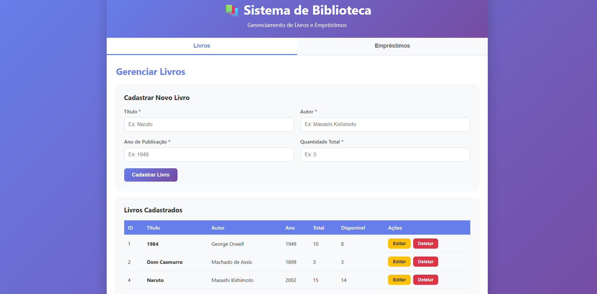
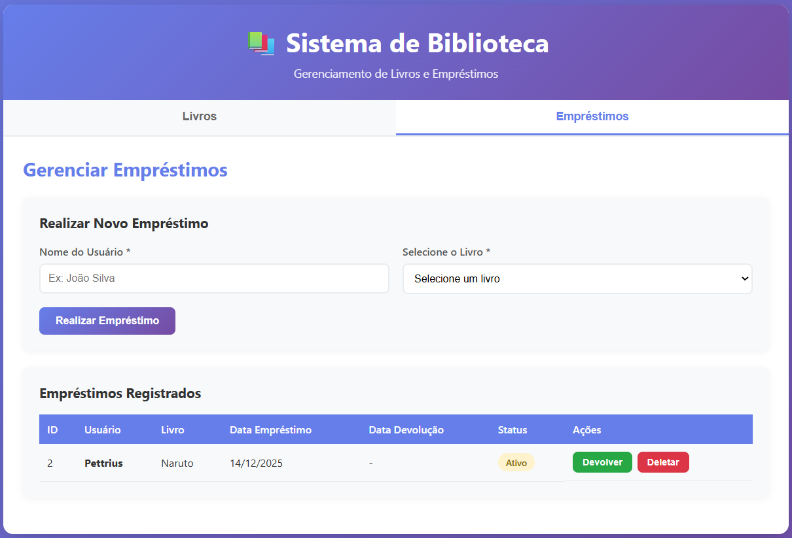

# 📚 Sistema de Gerenciamento de Biblioteca (MVP)

> **Projeto de Avaliação Técnica** | Vaga de Estágio em Desenvolvimento

---

## 📖 Sobre o Projeto

Este é um **Sistema de Gerenciamento de Biblioteca** desenvolvido como um MVP (Minimum Viable Product). O objetivo é demonstrar a construção de uma aplicação **Full-stack** robusta, com uma separação clara de responsabilidades:
* **Backend:** API RESTful.
* **Frontend:** Aplicação web para interação com o usuário.

---

### 🎯 Funcionalidades Principais
* **Controle de Acervo:** Cadastro e gerenciamento de livros.
* **Gestão de Empréstimos:** Controle de fluxo de retirada e devolução de exemplares.

---

## 🛠️ Tecnologias Utilizadas

* **Linguagem:** Python 3.8+
* **Banco de Dados:** MySQL Server 5.7+
* **Frontend:** HTML5, CSS3, JavaScript (Nativo)
* **API:** Flask (Inferido pelo contexto, ajuste se for Django/FastAPI)

---

## 🚀 Como Rodar o Projeto

Siga os passos abaixo para configurar o ambiente de desenvolvimento.

### Pré-requisitos
Certifique-se de ter instalado:

* [Python 3.8+](https://www.python.org/)
* [MySQL Server](https://dev.mysql.com/downloads/mysql/)
* Um navegador web moderno.

### 🗄️ 1. Configurar o Banco de Dados

Acesse o MySQL:
```
mysql -u root -p
CREATE DATABASE biblioteca_db;
EXIT;
```

### 🗄️ 2. Rodar o Backend

Navegue até a pasta do backend:
```
cd backend
```

Crie um ambiente virtual (recomendado):
```
python -m venv venv
```

Ative o ambiente virtual:

Windows:
```
venv\Scripts\activate
```

Linux / macOS:
```
source venv/bin/activate
```

Instale as dependências:
```
pip install -r requirements.txt
```

Crie o arquivo .env na pasta backend (opcional, mas recomendado):
```
DB_USER=root
DB_PASSWORD=sua_senha
DB_HOST=localhost
DB_PORT=3306
DB_NAME=biblioteca_db
```

Inicie o servidor:
```
python app.py
```

📍 O backend estará disponível em:
```
http://localhost:5000
```

---

### 🌐 3. Rodar o Frontend

## Pré-requisitos

✅ Backend da API deve estar rodando em http://localhost:5000
✅ Navegador web moderno (Chrome, Firefox, Edge, etc.)

# Opção 1: Abrir Diretamente (Mais Simples)

Navegue até a pasta do frontend:

```
cd C:\Users\pettr\Desktop\ProvaEstagio\biblioteca-mvp\frontend
```

Clique duas vezes no arquivo index.html

Pronto! O sistema abrirá no seu navegador padrão.

# Opção 2: Usar Servidor Local (Recomendado)
Para evitar problemas de CORS, é melhor usar um servidor local:
Com Python (Se você já tem Python instalado):
```
cd C:\Users\pettr\Desktop\ProvaEstagio\biblioteca-mvp\frontend
python -m http.server 8000
```
Depois acesse: http://localhost:8000

---

### 📸 Capturas de Tela




---

### 📅 Planejamento do Projeto
O detalhamento das tarefas, requisitos e o cronograma de desenvolvimento estão documentados no Notion:

### 🔗 Acessar Planejamento no Notion

* [NOTION](https://www.notion.so/Prova-Estagi-rio-Desenvolvimento-API-Client-1e29b9448bfc806582a8c8d8fd9cc189?source=copy_link)
  
---

### 👨‍💻 Autor

## Pettrius Vilas Boas De Paiva Cardoso

Projeto desenvolvido como parte do processo seletivo para vaga de Estagiário em Desenvolvimento.
